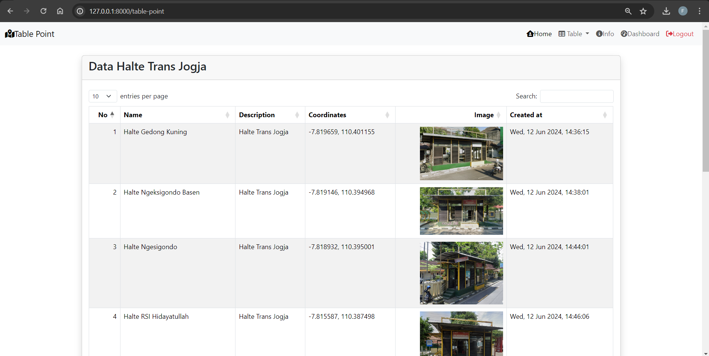
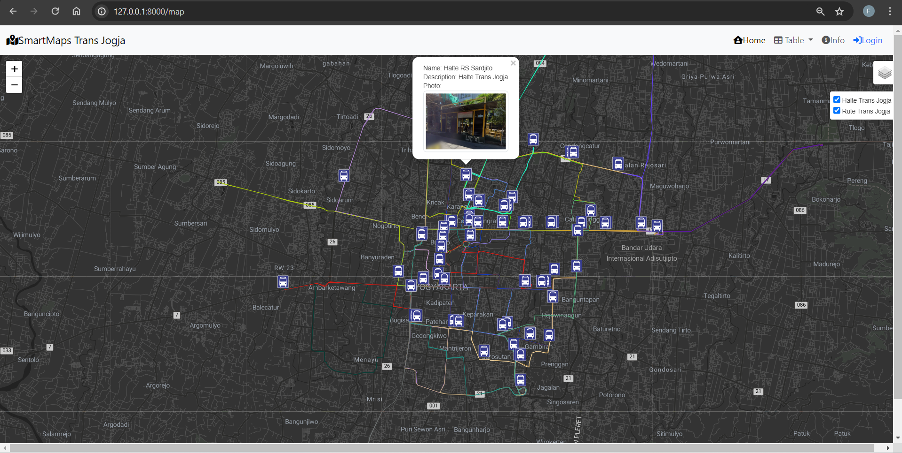
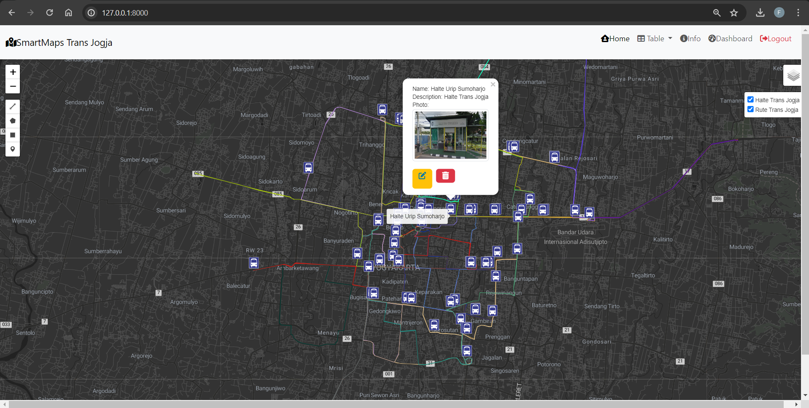

# Utilitas Trans Jogja

>SmartMaps Trans Jogja 

    SmartMaps Trans Jogja merupakan sebuah Platform yang digunakan sebagai sarana dalam visualisasi rute dan halte trans jogja yang berisikan data rute perjalanan bus trans jogja dan titik lokasi halte.

>Komponen Pembangun

    Beberapa komponen yang ditampilkan diambil dari database DBeaver, Library LeafletJS, Bootstrap, File GeoJSON, dan Plugin pada muka Peta

>Manfaat & Tujuan
1. Menciptakan platform yang menyediakan semua informasi terkait rute dan halte Trans Jogja secara terpusat dan terstruktur.
2. Mendukung penyedia layanan dalam mengelola dan mengoptimalkan rute serta penjadwalan bus.
3. Memudahkan akses bagi semua kalangan, termasuk mereka yang memiliki keterbatasan akses teknologi, melalui antarmuka yang user-friendly.

>Sumber Data
1. [Shapefile Rute Trans Jogja]
2. [Titik Halte Trans Jogja dari Google Maps]

>Screenshot Website
### Home Page
>
### Map Public
>
### Map Login
>
### Data
>

>Dikembangkan oleh [Faiz Hamdan Zulfa](https://github.com/FaizHamdan/pgwl_responsi.git)

>Link Project
>[Github] : https://github.com/FaizHamdan/pgwl_responsi.git